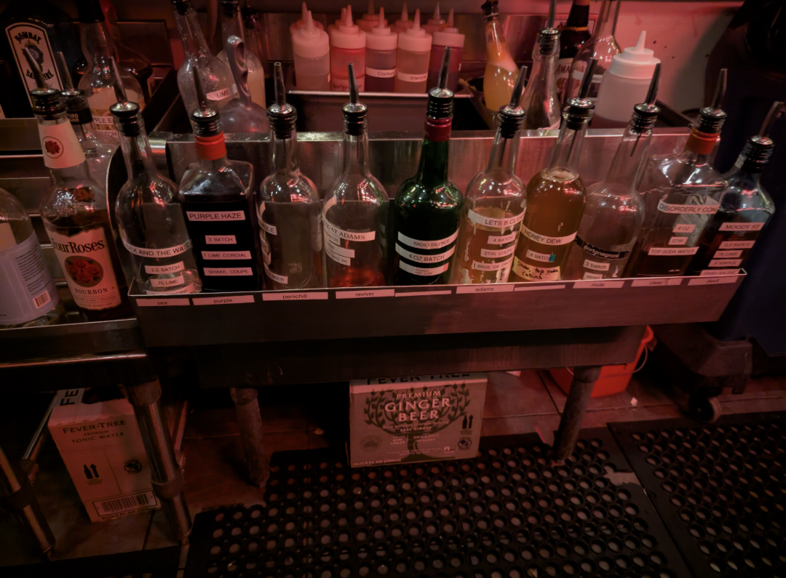
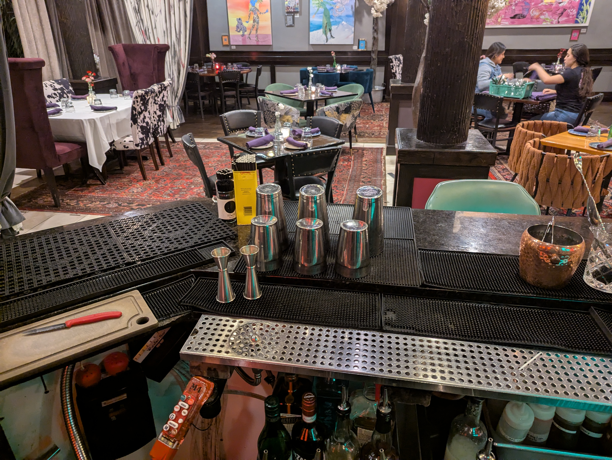

---
{"up":null,"related":null,"created":"2024-12-22","tags":null,"banner":"[[Pasted image 20241222145747.png]]","title":"Bartender Handbook","publish":true,"PassFrontmatter":true}
---

Creating cocktails relies on the [[Theory/mother recipe\|mother recipe]] theory. Keep this in mind always when mixing and serving.
## Drinks at [[Atlas/+/Sweet Basil Waltham\|Sweet Basil Waltham]]

The drinks served at Sweet Basil Waltham.

#### Classic Drinks
- [[Drinks/At Sweet Basil/Fountain of Youth NA\|Fountain of Youth NA]]
- [[Drinks/At Sweet Basil/Espresso Martini\|Espresso Martini]]
- [[Drinks/At Sweet Basil/Penichillin'\|Penichillin']]
- [[Drinks/At Sweet Basil/Purple Haze\|Purple Haze]]
- [[Drinks/At Sweet Basil/Sex and the Watch City\|Sex and the Watch City]]
- [[Drinks/At Sweet Basil/Uncut Jams\|Uncut Jams]]

#### Shaken
- [[Atlas/+/Rosemary's Baby\|Rosemary's Baby]]

#### Carbonated
- [[Drinks/At Sweet Basil/Mezcal Mule\|Mezcal Mule]]
- [[Drinks/At Sweet Basil/Disorderly Conduct\|Disorderly Conduct]]
- [[Atlas/+/Argentine 75\|Argentine 75]]
- [[Atlas/+/Brown Eyed Girl\|Brown Eyed Girl]]

#### Stirred
- [[Atlas/+/An Offer You Can't Refuse\|An Offer You Can't Refuse]]
- [[Atlas/+/Wednesday Adams\|Wednesday Adams]]
- [[Drinks/Let's Be Clear\|Let's Be Clear]]

## Thanksgiving drinks
- [[Drinks/Gimlet\|Gimlet]]
- [[Drinks/Old Fashioned\|Old Fashioned]]
- [[Atlas/+/Vodka Sour with a Bitters Kick\|Vodka Sour with a Bitters Kick]]
- [[Atlas/+/Whisky Sour Twist\|Whisky Sour Twist]]

- [ ] Cut limes 

## Mother Recipes

- [[index\|index]]
- [[Drinks/Sour\|Sour]]
- [[Drinks/Old Fashioned\|Old Fashioned]]
- [[Drinks/Martini\|Martini]]
- [[Drinks/Let's Be Clear\|Let's Be Clear]]
- [[Drinks/Highball\|Highball]]
- [[Drinks/Daisy\|Daisy]]
- [[Drinks/Daiquiri\|Daiquiri]]
- [[Atlas/+/Wednesday Adams\|Wednesday Adams]]
- [[Atlas/+/An Offer You Can't Refuse\|An Offer You Can't Refuse]]

## Setup

At start
- empty the fridges 
- check fruit
- juice lemons and limes 

[[https://bloximages.newyork1.vip.townnews.com/dailynebraskan.com/content/tncms/assets/v3/editorial/0/da/0dad4366-4bf8-11ec-85aa-ebb17a277faf/619c3c366811f.image.jpg?resize=1200%2C675\|https://bloximages.newyork1.vip.townnews.com/dailynebraskan.com/content/tncms/assets/v3/editorial/0/da/0dad4366-4bf8-11ec-85aa-ebb17a277faf/619c3c366811f.image.jpg?resize=1200%2C675]]